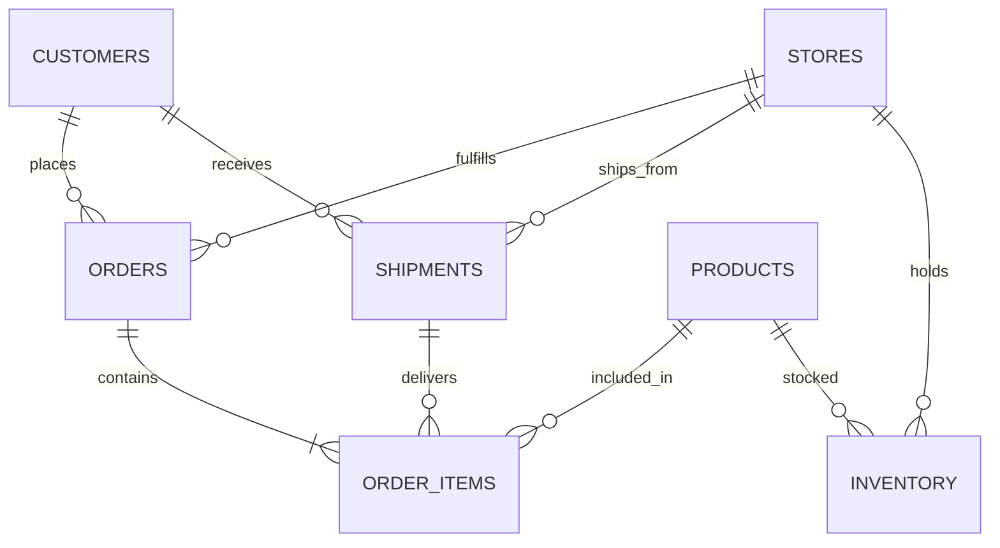
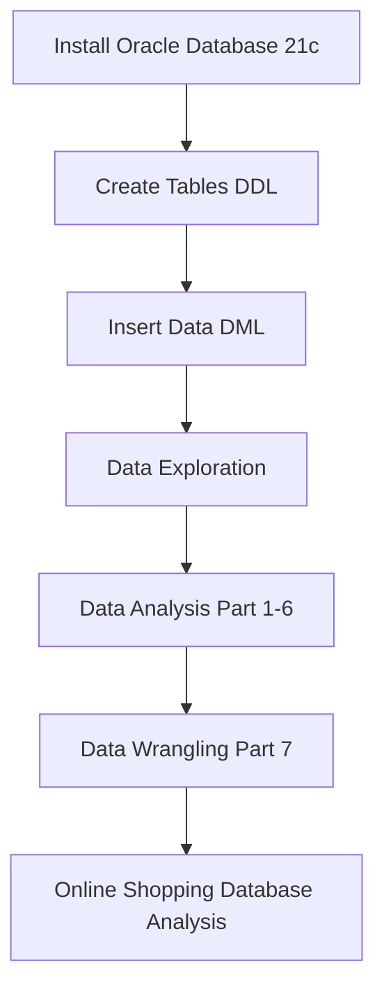

# SQL-end-to-end-project for Data Gathering and Analysing using Oracle Database

𝗔𝗜𝗠:  
In this SQL Project for Data Analysis, We will learn to efficiently leverage various analytical features and functions accessible through SQL in Oracle Database.

𝗪𝗵𝗮𝘁 𝗶𝘀 𝘁𝗵𝗲 𝗔𝗴𝗲𝗻𝗱𝗮 𝗼𝗳 𝘁𝗵𝗲 𝗽𝗿𝗼𝗷𝗲𝗰𝘁?  
The project’s Agenda involves Analyzing the data using SQL on the Oracle Database Software. We first download the Oracle Database 21c edition from the Oracle website and understand the problem. Then tables are created in the database followed by data insertion into tables and exploration, i.e., noticing relationships between tables, walking through the columns, and seeing comments. And perform the following activties--  
1. Records are displayed in an ordered manner, handling NULL values, and selecting records based on patterns like Wildcard, Operators, etc. Then working on Data Manipulation commands(DML) for Data Analysis. Then taking Backup of the Table where migration is going on and use COMMIT and ROLLBACK commands.   
2. Understanding different types of Joins(Inner join, Left outer join, Right outer join, Full outer join, Self join), different types of Operators(Minus, Union, Union all, Intersect).  
3. data analysis using Sub-query, Group-by clause and Exists clause. It also consists of using inline view and aggregate functions(Min, Max, Count, Avg) to perform better analysis on data.  
4. data analysis using WITH clause, the difference between COUNT(*) and COUNT(column_name), Categorization using the CASE statement, and various real-life case studies/problem statements.  
5. data analysis using different SQL functions like ROW_NUMBER, RANK, DENSE_RANK, SUBSTR, INSTR, COALESCE and NVL. It also involves the use of some built-in functions like concat, upper, lower, initcap, rtrim, ltrim, length, lpad, rpad.  
6. introduction to Data Wrangling, operations on missing data, unwanted features and duplicated records. It also involves the use of the pivot and unpivot in SQL.  
7. understanding of the Online Shopping Database, and using this database to perform the following Data Wrangling activities-  
a. Split full name into the first name and last name.  
b. Correct phone numbers and emails which are not in a proper format and Correct contact number and remove full name.  
c. Read BLOB column and fetch attribute details from the regular tag, nested columns.  
d. Create separate tables for blob attributes.  
e. Remove invalid records from order_items where shipment_id is not mapped.  
f. Map missing first name and last name with email id credentials.  

𝗪𝗵𝗮𝘁 𝗶𝘀 𝗗𝗮𝘁𝗮𝘀𝗲𝘁 𝗔𝗻𝗮𝗹𝘆𝘀𝗶𝘀?  
Dataset Analysis is defined as manipulating or processing unstructured data or raw data to draw valuable insights and conclusions that will help derive critical decisions that will add some business value. The dataset analysis process is followed by organizing the dataset, transforming the dataset, visualizing the dataset, and finally modeling the dataset to derive predictions for solving the business problems, making informed decisions, and effectively planning for the future.

𝗗𝗮𝘁𝗮 𝗣𝗶𝗽𝗲𝗹𝗶𝗻𝗲:  
It refers to a system for moving data from one system to another. The data may or may not be transformed, and it may be processed in real-time (or streaming) instead of batches. A data pipeline is extracting or capturing data using various tools, storing raw data, cleaning, validating data, transforming data into a query-worthy format, visualization of KPIs including Orchestration of the above process is data pipeline.  

𝗢𝗿𝗮𝗰𝗹𝗲 𝗦𝗤𝗟 𝗗𝗲𝘃𝗲𝗹𝗼𝗽𝗲𝗿:
Oracle SQL Developer is a free IDE that makes it easy to develop and operate Oracle Database in both traditional and cloud environments. SQL Developer is a complete end-to-end development of PL/SQL jobs, worksheets for running queries and scripts,and comprehensive data modeling output.  

𝗧𝗲𝗰𝗵 𝘀𝘁𝗮𝗰𝗸:  
● SQL Programming language  
● Oracle SQL Developer

𝗞𝗲𝘆 𝗧𝗮𝗸𝗲𝗮𝘄𝗮𝘆𝘀:  
● Understanding the project and how to use Oracle Database 21c.                                                                                                         
● Understanding the basics of data analysis, SQL commands, and their application.  
● Working on DML commands and listing employee details based on complex nested conditions.  
● Introduction to Oracle SQL Developer.  
● Usage of Oracle SQL Developer and connecting it to Oracle Database.  
● Creating tables and Inserting data into them.  
● Listing Employees and Departments based on some conditions.  
● Displaying records in an ordered manner using DESC keyword and Handling NULL values.  
● Selecting records based on some patterns like operators etc and Working on DML commands for analysis.    
● Creating a backup of the table where migration is going on and Executing COMMIT and ROLLBACK commands.    
● Listing DISTINCT & Renaming the column records for analysis.  
● Listing down employee details based on complex nested conditions.  
● Understanding different types of joins and operators.  
● Understanding the difference between normal queries and ANSI queries.  
● Joining multiple tables & with ANSI queries.  
● Understanding the difference between UNION and UNION ALL operators.  
● Understanding ambiguously defined error and resolving column ambiguoty.  
● Understanding different types of aggregate functions(Min, Max, Count, Avg) & clauses.  
● Data analysis using Sub-query and its background process.  
● Understanding the inline view and Data analysis using Group-by clause.  
● Combine different aggregate results in a single row.  
● Understanding the difference between COUNT(*) and COUNT(column_name).  
● Data analysis using WITH clause and Simplify query with WITH clause and View.  
● Categorization using CASE statement and the use of the ROWNUM clause.  
● Understanding the ROW_NUMBER function and SUBSTR and INSTR functions.  
● Data analysis using the RANK function and Difference between RANK and DENSE_RANK functions.  
● Data analysis using the built-in functions. Deal with NULL values using the NVL function.  
● Understanding the use of COALESCE function. Change the date format.  
● Understanding the concept of Data Wrangling. Remove unwanted features from data using SQL queries.  
● Deal with missing data. How to remove missing data and how to impute missing data using SQL queries.  
● Understanding Pivot and Unpivot functions in SQL.  
● Pivoting rows to columns using SQL queries. Pivoting rows to columns with joins using SQL queries.  
● Understanding the concept of Data Wrangling and Online Shopping database.  
● Perform Data Wrangling activities on the data.

𝗜𝗻𝘀𝘁𝗮𝗹𝗹𝗮𝘁𝗶𝗼𝗻 𝘀𝘁𝗲𝗽𝘀 𝗵𝗲𝗿𝗲:  
https://github.com/kushalvishwak/SQL-end-to-end-project-for-client-POC/tree/main/Installation%20%26%20Execution/Installation%20%26%20Execution

�𝗶𝘀𝘂𝗮𝗹𝗶𝘇𝗮𝘁𝗶𝗼𝗻𝘀:

### Database Schema ER Diagram

### Project Workflow

�𝗦𝗼𝗹𝘂𝘁𝗶𝗼𝗻 𝘄𝗶𝘁𝗵 𝗦𝗼𝘂𝗿𝗰𝗲 𝗖𝗼𝗱𝗲:  
https://github.com/kushalvishwak/SQL-end-to-end-project-for-client-POC/tree/main/Codes 

  

